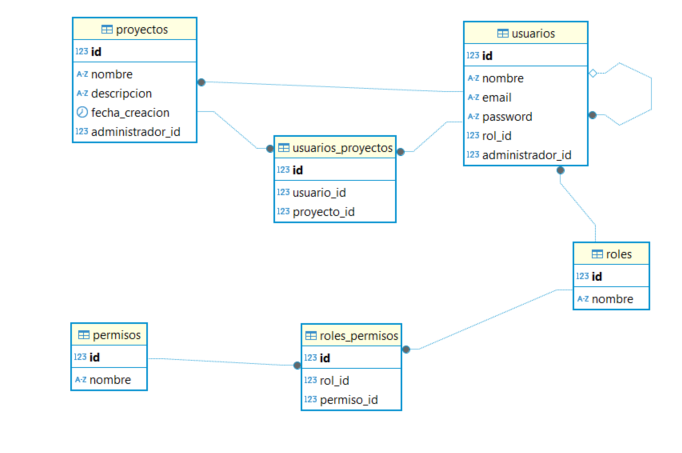

# 🚀 Proyecto Web Full Stack

## 🌟 Descripción

Este es un proyecto web moderno y robusto construido con tecnologías de última generación. Combina un frontend potente en Angular con un backend seguro en Node.js, ofreciendo una experiencia de usuario excepcional y un rendimiento óptimo.

## 🛠️ Tecnologías Principales

### Frontend
- **Angular 18** - Framework frontend de última generación
- **Material Design** - Componentes UI modernos y responsivos
- **Bootstrap 5** - Framework CSS para diseño adaptativo
- **NgX Charts & ApexCharts** - Visualización de datos avanzada
- **FullCalendar** - Gestión de calendarios y eventos
- **Múltiples integraciones** - Google Maps, PDF Viewer, y más

### Backend
- **Node.js & Express** - Servidor robusto y eficiente
- **PostgreSQL & Sequelize** - Base de datos relacional con ORM
- **JWT & Bcrypt** - Autenticación y seguridad avanzada
- **Helmet** - Protección adicional para el servidor
- **CORS** - Gestión de solicitudes cross-origin

## 🚀 Características Destacadas

- ✨ Interfaz de usuario moderna y responsive
- 🔒 Sistema de autenticación seguro
- 📊 Visualización de datos avanzada
- 📅 Sistema de calendario integrado
- 🗺️ Integración con Google Maps
- 📱 Diseño mobile-first
- 🌐 API RESTful
- 🔐 Seguridad robusta

### PostgreSQL
<div align="center">
  
</div>

## 🏃‍♂️ Inicio Rápido

### Requisitos Previos
- Node.js (versión LTS recomendada)
- PostgreSQL
- Angular CLI

### Configuración del Frontend
```bash
cd frontend
npm install
ng serve
```
La aplicación estará disponible en `http://localhost:4200`

### Configuración del Backend
```bash
cd backend
npm install
npm run dev
```
El servidor estará disponible en `http://localhost:3000`

## 📚 Documentación

### Estructura del Proyecto
```
proyecto/
├── frontend/           # Aplicación Angular
│   ├── src/           # Código fuente
│   ├── dist/          # Archivos compilados
│   └── ...
├── backend/           # Servidor Node.js
│   ├── src/          # Código fuente
│   └── ...
└── README.md         # Este archivo
```
